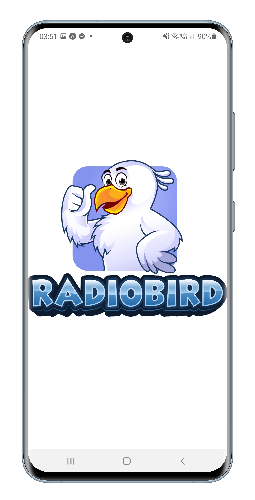
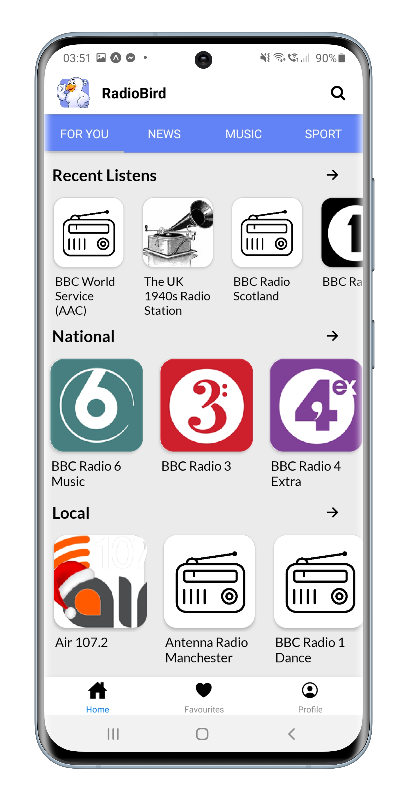
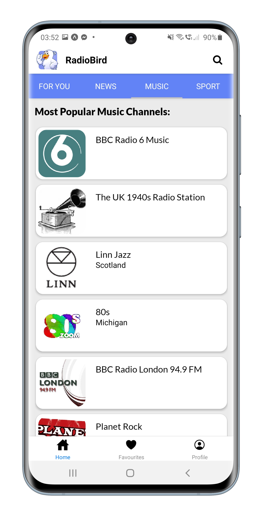
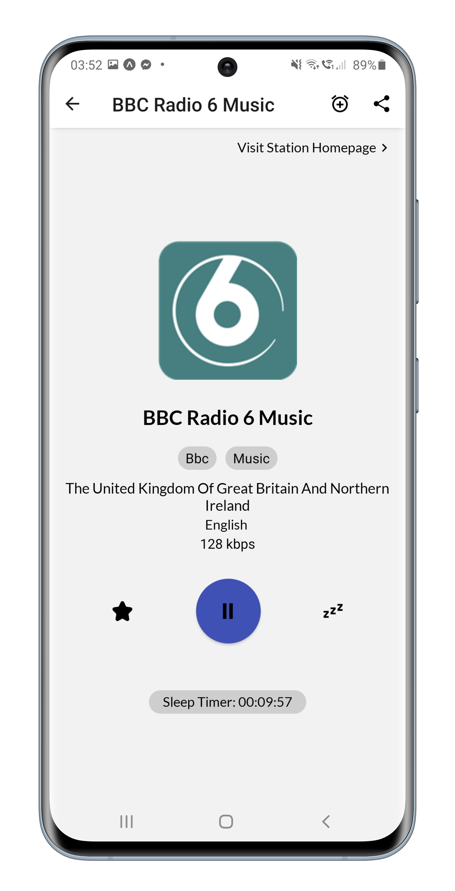
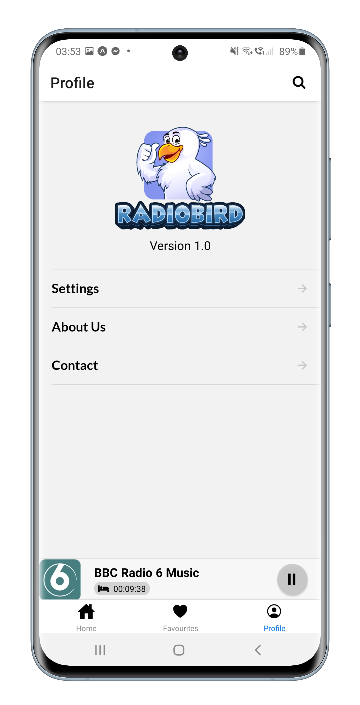
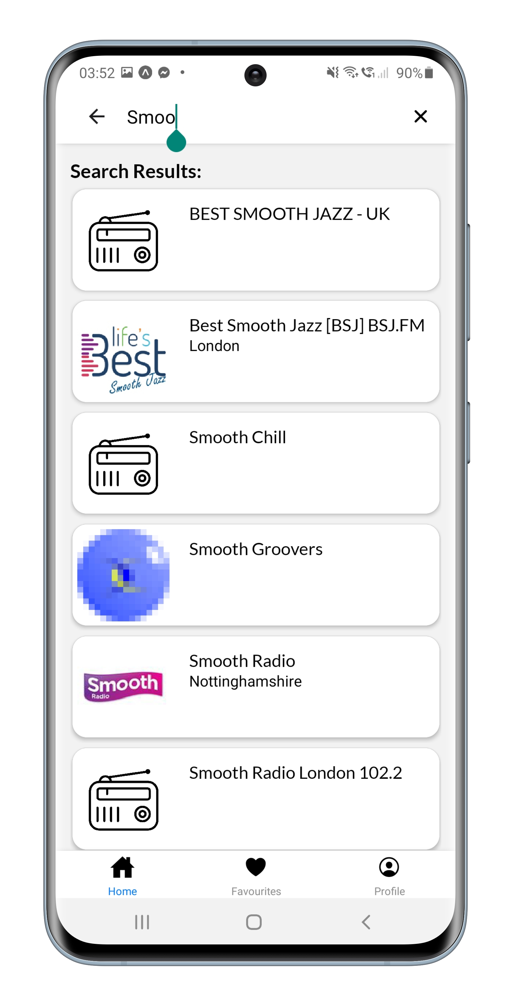

# What is RadioBird?
RadioBird is a simple Radio App which provides users with more than 20,000 radio stations from across the globe! I personally love music, foreign languages and learning about foreign cultures - giving birth to RadioBird. 

In addition to giving you access to the world's radio, RadioBird also includes the following features:

 - Sleep Timer
 - Radio Alarm
 - Saving your Recent Listens & Favourties
 - Browse By Genre or Country

# Tech Stack
- React Native
- TypeScript
- Context API
- NodeJS
- Expo Client
- Native Base UI Library
- Open Source Radio API

*Disclaimer - RadioBird makes use of your device's localStorage 

# Running RadioBird Dev Version

First, make sure you have expo client app installed on your device. 

1. Fork or clone this repo 🍴

2. cd into the repo & run npm i to install node modules

3. 🚀 expo start - scan the QR code and make sure both your phone & your computer are connected on the same wifi network.

# Images 
 </img> </img> </img> </img> </img> </img> 

# Next Steps

My love for the Radio and RadioBird doesn't stop here -

Aiming to get it deployed on the Google Play Store
Adding Podcasts
Linking a song recognizer API so the user can find out the name of the song they're listening to! 

